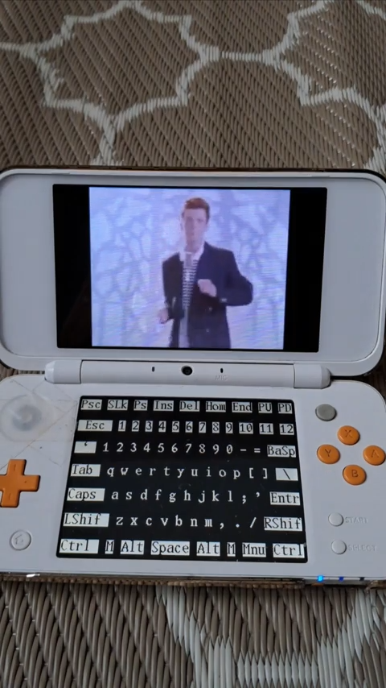

# 3DS Linux Video Player

#### This is a project i did a few months ago here's how :
I was messing a bit with Linux on the 3DS and i discovered that if i send any data to the framebuffer of the console (`/dev/fb0` like in any Linux device) it will be displayed, so then i rebuild the logic of [this converter](https://xem.github.io/3DShomebrew/tools/image-to-bin.html) in a Python script to convert normal PNGs to a format compatible with the 3DS framebuffer, these PNGs being frames extracted from a MP4 video.

## How to get Linux on the console?
To get Linux installed on your 3DS, to install it you can just extract the contents of [linux_3ds_install.zip](https://github.com/AtexBg/3ds-linux-video-player/blob/main/linux_3ds_install.zip), (compatible with all 3DS models) and put the files at the root of your SD card, or follow [this tutorial](https://www.gamebrew.org/wiki/Linux_for_3DS).

## How to run the video player?
### **ON YOUR PC:**
Create a directory with the scripts and your video, it should look like that :
```
Directory/
 | 1 - Extract frames from video.py
 | 2 - Crop to 400x240.py
 | 3 - Convert to binary format.py
 | video.sh
 | video.mp4
```
⚠️ The video file should be named "video.mp4"`

>Works for GIF animations too, but you have to rename it to video.mp4

Then, execute the scripts in their order (the "1 - Extract..." first, then the "2 - Crop to...", etc...)
After that, you should have 3 new directories : "**frames**", "**cropped_frames**" and "**bin_frames**".
Now you can delete the first two folders, they were temporary : the "*bin_frames*" dir contains the frames that will be loaded onto the framebuffer.

### Transfer files to the console
**⚠️Linux on the 3DS can't write to the SD card, it only have read access.**
You now have to put the video.sh script on your SD card next to the "*bin_frames*" folder, i personally use an "sh" folder so it should look like that:
```
SD card root/
 |-sh/ 
 |  |-video.sh
 |  |-bin_frames/
 |    |-1.bin
 |    |-2.bin
 |    |-3.bin
 |    |-ect...
 |-3ds/
 |-luma/
 |-ect...
```
### **ON THE CONSOLE**:
Now you have to boot into Linux, for that you can load the firmware file (down_firm_linux_loader.firm) by holding "Down" on the D-Pad while powering on the console, then enter the following commands to access the SD card:
```
mkdir /sd
mount /dev/vda1 /sd
cd /sd/sh (or wherever you put the files)
```
Then make the script executable:
`chmod +x video.sh`

And then launch it:
`./video.sh`


